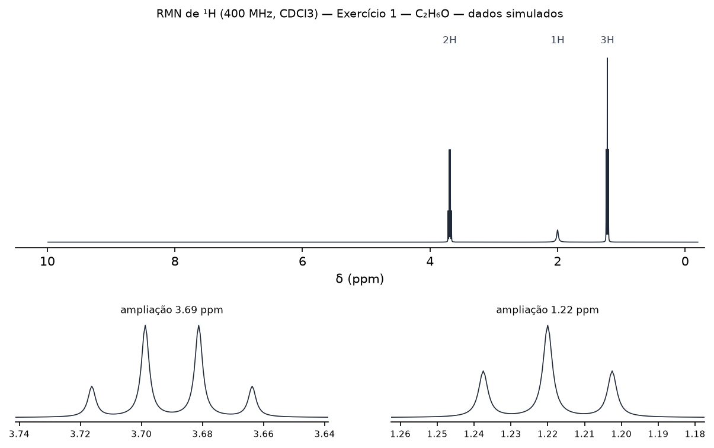
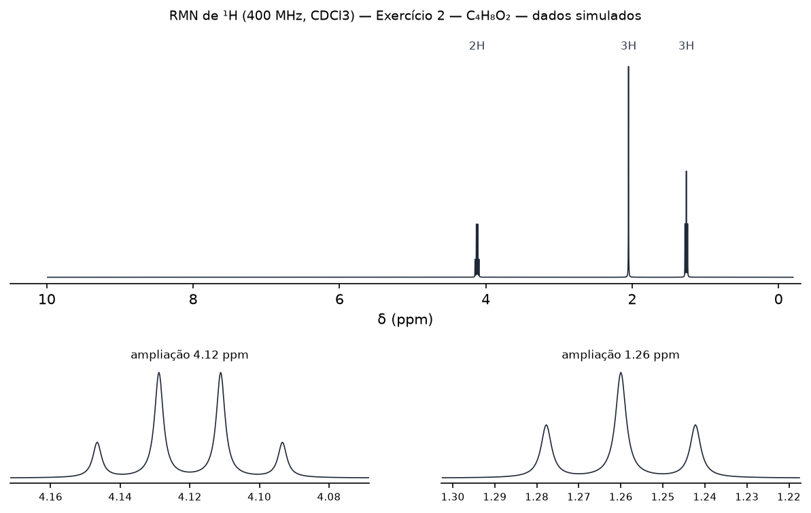
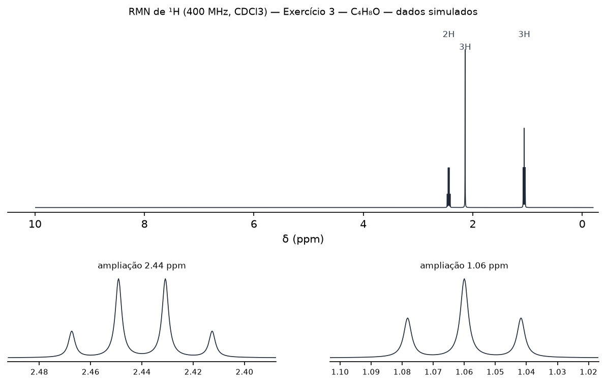
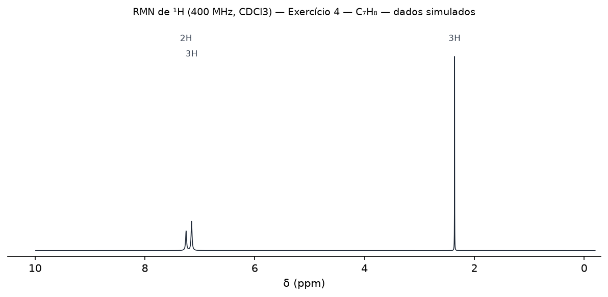
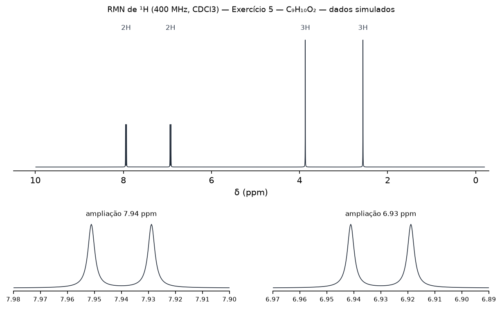

# Revisão dos dados químicos — RMN Tutor

> **Contém as respostas dos exercícios.** Documento para o revisor (professor/autor).
> Gerado por `backend/scripts/build_review_doc.py`; edite os YAML em
> `backend/app/exercises/data/` e rode o script de novo.

Ao concluir a revisão de um exercício: corrija o YAML se necessário, preencha
`reviewed: true`, `reviewed_by: "Nome"`, `sources: [...]`, rode
`python scripts/render_exercise_images.py` e este script, e faça commit.

## ex01 — Exercício 1 — C₂H₆O

- Resposta: **etanol** — `CCO` (C2H6O, MW 46.069)
- Condições: 400 MHz, CDCl3; fórmula informada C2H6O
- Status: reviewed = `false`, revisor = —

| ID | δ (ppm) | Integral | Mult. | J (Hz) | Nota |
|---|---|---|---|---|---|
| P1 | 3.69 | 2.0 | q | 7 |  |
| P2 | 2 | 1.0 | br_s | — | posição variável |
| P3 | 1.22 | 3.0 | t | 7 |  |

- [ ] Deslocamentos químicos conferidos
- [ ] Integrais conferidas
- [ ] Multiplicidades conferidas
- [ ] Constantes J conferidas
- [ ] Solvente/frequência coerentes
- [ ] Fonte bibliográfica registrada em `sources`

## ex02 — Exercício 2 — C₄H₈O₂

- Resposta: **acetato de etila** — `CCOC(C)=O` (C4H8O2, MW 88.106)
- Condições: 400 MHz, CDCl3; fórmula informada C4H8O2
- Status: reviewed = `false`, revisor = —

| ID | δ (ppm) | Integral | Mult. | J (Hz) | Nota |
|---|---|---|---|---|---|
| P1 | 4.12 | 2.0 | q | 7.1 |  |
| P2 | 2.05 | 3.0 | s | — |  |
| P3 | 1.26 | 3.0 | t | 7.1 |  |

- [ ] Deslocamentos químicos conferidos
- [ ] Integrais conferidas
- [ ] Multiplicidades conferidas
- [ ] Constantes J conferidas
- [ ] Solvente/frequência coerentes
- [ ] Fonte bibliográfica registrada em `sources`

## ex03 — Exercício 3 — C₄H₈O

- Resposta: **2-butanona** — `CCC(C)=O` (C4H8O, MW 72.107)
- Condições: 400 MHz, CDCl3; fórmula informada C4H8O
- Status: reviewed = `false`, revisor = —

| ID | δ (ppm) | Integral | Mult. | J (Hz) | Nota |
|---|---|---|---|---|---|
| P1 | 2.44 | 2.0 | q | 7.3 |  |
| P2 | 2.14 | 3.0 | s | — |  |
| P3 | 1.06 | 3.0 | t | 7.3 |  |

- [ ] Deslocamentos químicos conferidos
- [ ] Integrais conferidas
- [ ] Multiplicidades conferidas
- [ ] Constantes J conferidas
- [ ] Solvente/frequência coerentes
- [ ] Fonte bibliográfica registrada em `sources`

## ex04 — Exercício 4 — C₇H₈

- Resposta: **tolueno** — `Cc1ccccc1` (C7H8, MW 92.141)
- Condições: 400 MHz, CDCl3; fórmula informada C7H8
- Status: reviewed = `false`, revisor = —

| ID | δ (ppm) | Integral | Mult. | J (Hz) | Nota |
|---|---|---|---|---|---|
| P1 | 7.25 | 2.0 | m | — |  |
| P2 | 7.15 | 3.0 | m | — |  |
| P3 | 2.36 | 3.0 | s | — |  |

- [ ] Deslocamentos químicos conferidos
- [ ] Integrais conferidas
- [ ] Multiplicidades conferidas
- [ ] Constantes J conferidas
- [ ] Solvente/frequência coerentes
- [ ] Fonte bibliográfica registrada em `sources`

## ex05 — Exercício 5 — C₉H₁₀O₂

- Resposta: **4'-metoxiacetofenona** — `COc1ccc(cc1)C(C)=O` (C9H10O2, MW 150.177)
- Condições: 400 MHz, CDCl3; fórmula informada C9H10O2
- Status: reviewed = `false`, revisor = —

| ID | δ (ppm) | Integral | Mult. | J (Hz) | Nota |
|---|---|---|---|---|---|
| P1 | 7.94 | 2.0 | d | 8.9 |  |
| P2 | 6.93 | 2.0 | d | 8.9 |  |
| P3 | 3.87 | 3.0 | s | — |  |
| P4 | 2.56 | 3.0 | s | — |  |

- [ ] Deslocamentos químicos conferidos
- [ ] Integrais conferidas
- [ ] Multiplicidades conferidas
- [ ] Constantes J conferidas
- [ ] Solvente/frequência coerentes
- [ ] Fonte bibliográfica registrada em `sources`

## Skill `nmr-spectroscopy` (conteúdo químico)

Arquivos em `.claude/skills/nmr-spectroscopy/`. Conferir definições, faixas e fontes citadas.

- [ ] `SKILL.md`
- [ ] `proton-nmr.md`
- [ ] `carbon-nmr.md`
- [ ] `coupling.md`
- [ ] `2d-nmr.md`
- [ ] `structure-elucidation.md`
